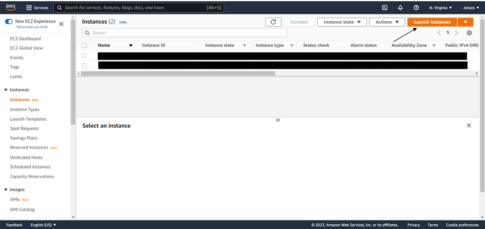
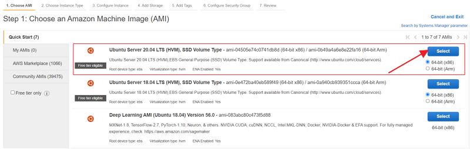
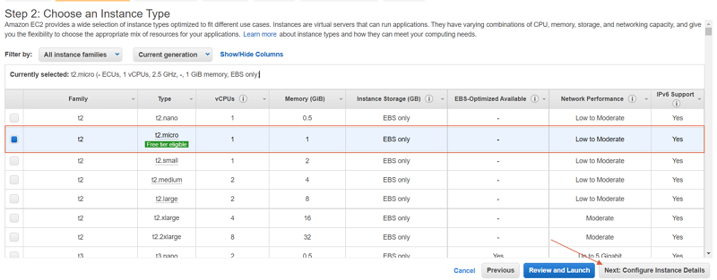

# Como crear y desplegar una aplicación en AWS
---
- Para los siguientes pasos daremos por hecho que tenemos una cuenta en AWS

## Crear la instancia en AWS
---
- Una vez estemos en la página principal de `Instances` haremos click en `Launch instances` para crear una nueva instancia

- Nos aparecerá una página para seleccionar nuestra máquina que usaremos como servidor. Seleccionaremos el de la capa gratuita `Ubuntu Server 20.04 LTS (HVM), SSD Volume Type` y haremos click en `Select`

- Nos aparecerá una página para seleccionar el tipo de instancia que usaremos. En este caso escogeremos el tipo `t2.micro` que también es de lal capa gratuita y haremos click en `Next: Configure Instance Details`

