# Como crear y desplegar una aplicación en AWS

---

- Para los siguientes pasos daremos por hecho que tenemos una cuenta en AWS

## Crear la instancia en AWS

---

- Una vez estemos en la página principal de `Instances` haremos click en `Launch instances` para crear una nueva instancia

- Nos aparecerá una página para seleccionar nuestra máquina que usaremos como servidor. Seleccionaremos el de la capa gratuita `Ubuntu Server 20.04 LTS (HVM), SSD Volume Type` y haremos click en `Select`

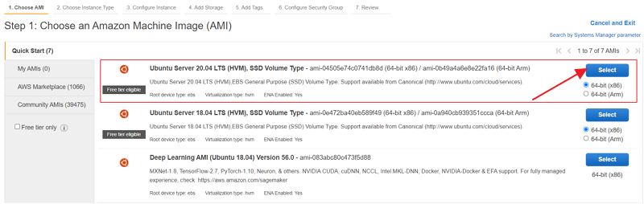

- Nos aparecerá una página para seleccionar el tipo de instancia que usaremos. En este caso escogeremos el tipo `t2.micro` que también es de lal capa gratuita y haremos click en `Next: Configure Instance Details`

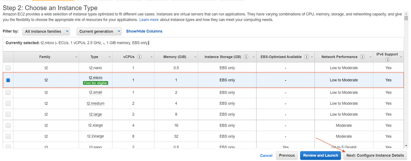

- En la siguiente página, la cual nos da la opción de configuración de nuestra instancia, no cambiaremos nada, excepto la opción `Enable termination protection`. Esta opción nos 'ayudará', a que, una vez creada la instancia no podamos borrar la misma accidentalmente. Después, haremos click en `Next: Add Storage`

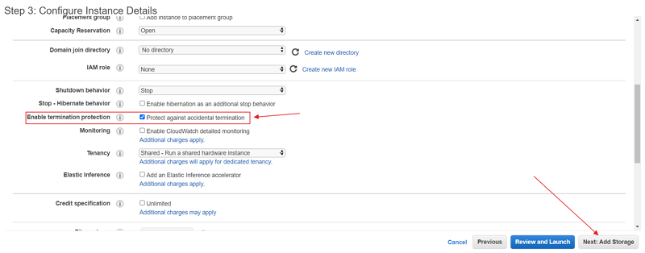

- Apareceremos en la pagina para configurar el almacenamiento de nuestro servidor. En este caso, no vamos a cambiar nada de la configuración y simplemente clickaremos en `Next: Add Tags`

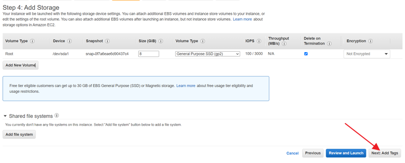

- En ésta página podemos añadir tags a nuestra instancia. Simplemente le daré un nombre a mi instancia haciendo click en `Add tag` y añadiendole como `Key: Name` y `Value: Practica-KC`, esto le dará ese nombre a nuestra instancia. Luego clickaremos en `Next: Configure Security Group`

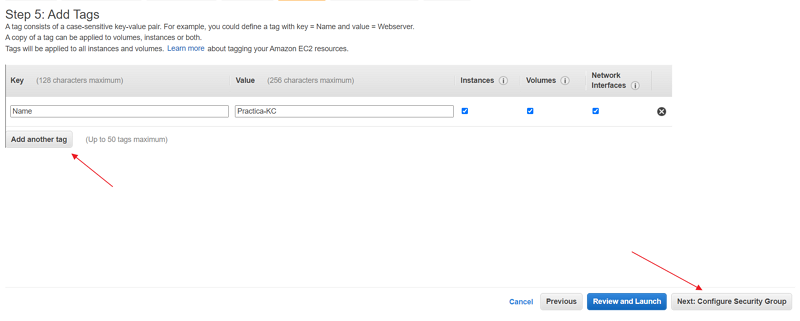

- En la pantalla de configuración de seguridad, podemos modificar los puertos que queremos que nuestra maquina tenga abiertos/cerrados. En caso de tener una máquina anterior y tengamos ya creado un grupo de seguridad, podemos seleccionarlo. En mi caso voy a crear un nuevo grupo con los puertos predefinidos. Después haremos click en `Review and Launch`

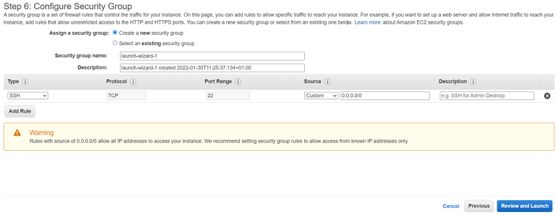

- Último paso antes de crear nuestra instancia, en el cual podemos revisar todas las configuraciones que hemos realizado y modificar antes de lanzarla. Una vez tengamos todo correcto, clickaremos en `Launch`

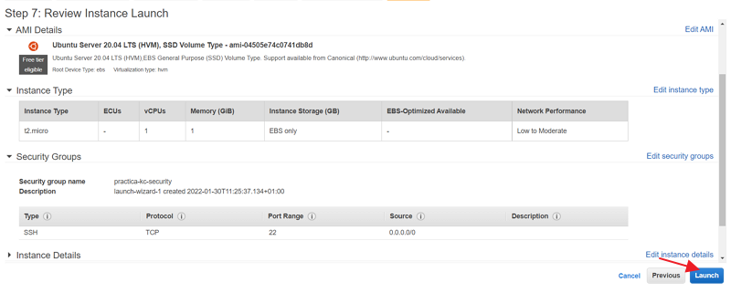

- Una vez clickemos en `Launch` nos saldrá una pantalla a la cual tendremos que prestar mucha atención. Ésta nos da un menú de opciones tal que éste:

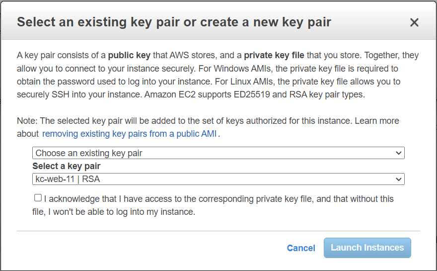

- Si hacemos click en `Choose an existing key pair` nos aparecerá lo siguiente:

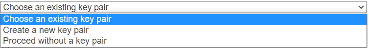

> En este punto, yo voy a crear una nueva `key`, pero si tenemos alguna ya creada y la queremos utilizar, simplemente, dejamos marcada la opcion `Choose an existing key pair` y en el select de abajo seleccionamos la clave a utilizar

- Para crear una nueva clave seleccionaremos la opcion `Create a new key pair` y nos aparecerá lo siguiente:

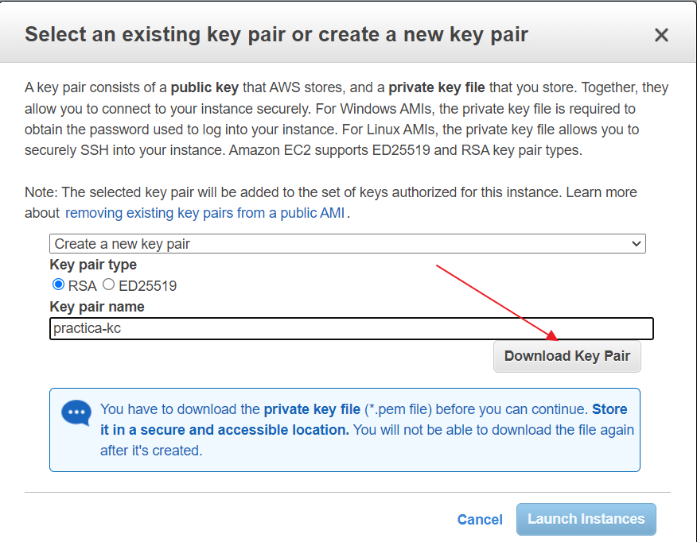

- Simplemente le introduciremos el nombre que le queremos dar a la clave y debemos descargar la misma.

  > ### IMPORTANTE!
  >
  > Debemos guardar esta clave y no perderla ni eliminarla pues es la que nos dará permiso para entrar en nuestra máquina

- Una vez descargada se nos habilitará el botón `Launch Instances` y ya podremos lanzar nuestra máquina

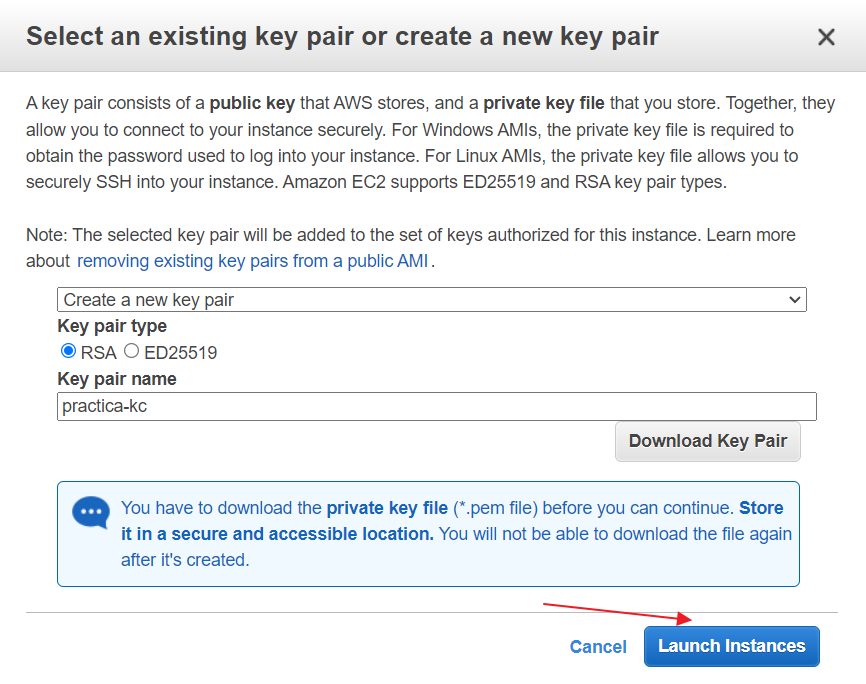

- Volvemos al menú y tendremos nuestra instancia ya corriendo:

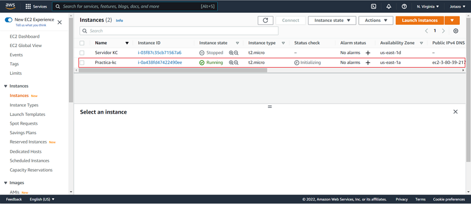

---

## Entrando a nuestro servidor

---

  > ### Nota
  > Yo utilizo Windows 10 para la configuración y `Git Bash`. Para los que no tengais instalado `Git Bash` os recomiendo [éste](https://www.stanleyulili.com/git/how-to-install-git-bash-on-windows/) tutorial para su instalación. Para seguir avanzando deberemos tener instalado `Git Bash`

- A continuación pasaremos a entrar a nuestro servidor. Desde el escritorio haremos click derecho y seleccionaremos `Git Bash Here`:

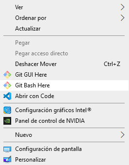

- Una vez seleccionada, nos aparecerá la terminal:

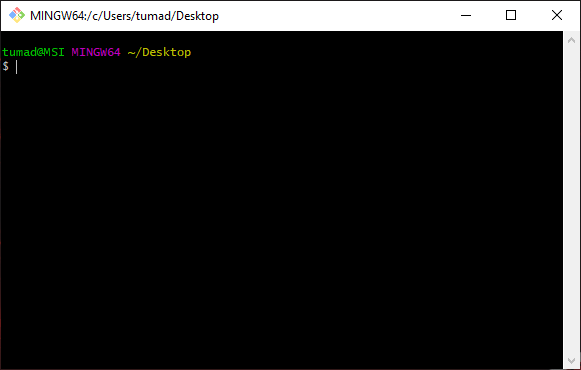

- Utilizaremos el siguiente comando para entrar en nuestro servidor `ssh -i <direccion_de_la_key> <usuario-servidor>@<ip_servidor>`

  > ### Explicación del comando:

  > SSH (o Secure SHell) es el nombre de un protocolo y del programa que lo implementa cuya principal función es el acceso remoto a un servidor por medio de un canal seguro en el que toda la información está cifrada. Extraido de [Wikipedia](https://es.wikipedia.org/wiki/Secure_Shell)

  > flag `-i`: Con esta flag le indicamos que le pasaremos una clave como siguiente parametro

  > `direccion_de_la_key`: Aqui introduciremos o, la ruta relativa al archivo clave descargado con anterioridad o la ruta absoluta

  > `usuario-servidor`: El usuario, en mi caso, será `ubuntu`, pues he seleccionado esa máquina

  > `ip_servidor`: La ip la obtendremos en la consola de aws, seleccionaremos nuestra instancia y deberemos copiar la `Public IPv4 address`:

  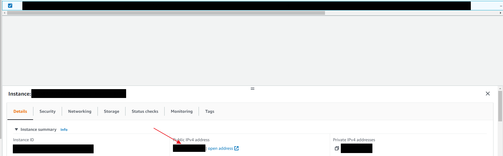

- En mi caso, como tengo la clave en el escritorio, mi comando será éste:

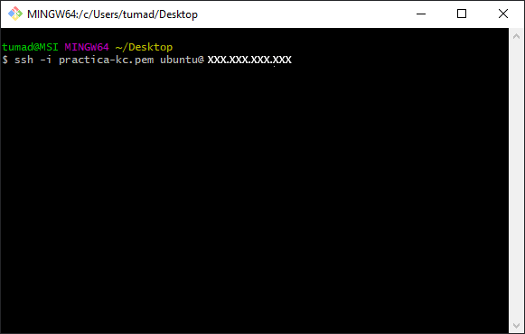

- Cuando pulsemos `INTRO` nos aparecerá la siguiente pantalla, la cual nos advierte que no conoce dicha dirección y estamos de acuerdo en que la guardemos como una direccion conocida, simplemente introducimos `yes` y pulsamos `INTRO`:

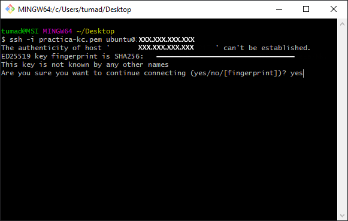

- Nos aparecerá un mensaje diciendonos que se ha añadido permanentemente mente la dirección a la lista de Hosts conocidos

- Una vez hecho esto, estaremos dentro de nuestro servidor

---

## Configurando nuestro servidor

---

# EN CONSTRUCCIÓN