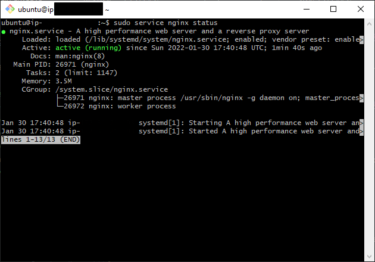

# Como desplegar una aplicación en AWS

---

- Para los siguientes pasos daremos por hecho que tenemos una cuenta en AWS

  ## INDICE

---

1. [Crear Instancia](#crear-la-instancia-en-aws)
   1. [Lanzando Instancia](#lanzando-instancia)
   2. [Seleccion de máquina](#seleccion-de-maquina)
   3. [Tipo de instancia](#tipo-de-instancia)
   4. [Configuracion de instancia](#configuracion-de-instancia)
   5. [Configuracion de almacenamiento](#configuracion-de-almacenamiento)
   6. [Configuracion de tags](#configuracion-de-tags)
   7. [Configuracion de seguridad](#configuracion-de-seguridad)
   8. [Ultima revision de instancia](#ultima-revision-de-instancia)
   9. [Creacion de clave de instancia](#creacion-de-clave-de-instancia)
2. [Entrando al servidor](#entrando-a-nuestro-servidor)
   1. [Entrando en Git Bash](#entrando-en-git-bash)
   2. [Comando de entrada al servidor](#comando-de-entrada-al-servidor)
3. [Configuracion del servidor](#configuracion-del-servidor)
   1. [Actualizando el servidor](#actualizando-el-servidor)
   2. [Configurando NGINX](#configurando-nginx)
   3. [Configurando puerto 80 en AWS](#configurando-puerto-80-en-aws)
4. [Incorporar un proyecto a nuestro servidor](#incorporar-un-proyecto-a-nuestro-servidor)
   1. [Antes de adjuntar proyecto](#antes-de-adjuntar-proyecto)
   2. [Enviando proyecto](#enviando-proyecto)
5. [Incorporar un proyecto React a nuestro servidor](#incorporar-un-proyecto-react-a-nuestro-servidor)

## Crear la instancia en AWS

---

#### Lanzando instancia

- Una vez estemos en la página principal de `Instances` haremos click en `Launch instances` para crear una nueva instancia


#### Seleccion de maquina

- Nos aparecerá una página para seleccionar nuestra máquina que usaremos como servidor. Seleccionaremos el de la capa gratuita `Ubuntu Server 20.04 LTS (HVM), SSD Volume Type` y haremos click en `Select`


#### Tipo de instancia

- Nos aparecerá una página para seleccionar el tipo de instancia que usaremos. En este caso escogeremos el tipo `t2.micro` que también es de lal capa gratuita y haremos click en `Next: Configure Instance Details`


#### Configuracion de instancia

- En la siguiente página, la cual nos da la opción de configuración de nuestra instancia, no cambiaremos nada, excepto la opción `Enable termination protection`. Esta opción nos 'ayudará', a que, una vez creada la instancia no podamos borrar la misma accidentalmente. Después, haremos click en `Next: Add Storage`


#### Configuracion de almacenamiento

- Apareceremos en la pagina para configurar el almacenamiento de nuestro servidor. En este caso, no vamos a cambiar nada de la configuración y simplemente clickaremos en `Next: Add Tags`


#### Configuracion de tags

- En ésta página podemos añadir tags a nuestra instancia. Simplemente le daré un nombre a mi instancia haciendo click en `Add tag` y añadiendole como `Key: Name` y `Value: Practica-KC`, esto le dará ese nombre a nuestra instancia. Luego clickaremos en `Next: Configure Security Group`


#### Configuracion de seguridad

- En la pantalla de configuración de seguridad, podemos modificar los puertos que queremos que nuestra maquina tenga abiertos/cerrados. En caso de tener una máquina anterior y tengamos ya creado un grupo de seguridad, podemos seleccionarlo. En mi caso voy a crear un nuevo grupo con los puertos predefinidos. Después haremos click en `Review and Launch`


#### Ultima revision de instancia

- Último paso antes de crear nuestra instancia, en el cual podemos revisar todas las configuraciones que hemos realizado y modificar antes de lanzarla. Una vez tengamos todo correcto, clickaremos en `Launch`


#### Creacion de clave de instancia

- Una vez clickemos en `Launch` nos saldrá una pantalla a la cual tendremos que prestar mucha atención. Ésta nos da un menú de opciones tal que éste:


- Si hacemos click en `Choose an existing key pair` nos aparecerá lo siguiente:


> ### Nota
>
> En este punto, yo voy a crear una nueva `key`, pero si tenemos alguna ya creada y la queremos utilizar, simplemente, dejamos marcada la opcion `Choose an existing key pair` y en el select de abajo seleccionamos la clave a utilizar

- Para crear una nueva clave seleccionaremos la opcion `Create a new key pair` y nos aparecerá lo siguiente:


- Simplemente le introduciremos el nombre que le queremos dar a la clave y debemos descargar la misma.

  > ### IMPORTANTE!
  >
  > Debemos guardar esta clave y no perderla ni eliminarla pues es la que nos dará permiso para entrar en nuestra máquina

- Una vez descargada se nos habilitará el botón `Launch Instances` y ya podremos lanzar nuestra máquina


- Volvemos al menú y tendremos nuestra instancia ya corriendo:


[**_Ir al indice_**](#indice)

---

## Entrando a nuestro servidor

---

> ### Nota
>
> Yo utilizo Windows 10 para la configuración y `Git Bash`. Para los que no tengais instalado `Git Bash` os recomiendo [éste](https://www.stanleyulili.com/git/how-to-install-git-bash-on-windows/) tutorial para su instalación. Para seguir avanzando deberemos tener instalado `Git Bash`

#### Entrando en Git Bash

- A continuación pasaremos a entrar a nuestro servidor. Desde el escritorio haremos click derecho y seleccionaremos `Git Bash Here`:


- Una vez seleccionada, nos aparecerá la terminal:


#### Comando de entrada al servidor

- Utilizaremos el siguiente comando para entrar en nuestro servidor `ssh -i <direccion_de_la_key> <usuario-servidor>@<ip_servidor>`

  > ### Explicación del comando:

  > SSH (o Secure SHell) es el nombre de un protocolo y del programa que lo implementa cuya principal función es el acceso remoto a un servidor por medio de un canal seguro en el que toda la información está cifrada. Extraido de [Wikipedia](https://es.wikipedia.org/wiki/Secure_Shell)

  > flag `-i`: Con esta flag le indicamos que le pasaremos una clave como siguiente parametro

  > `direccion_de_la_key`: Aqui introduciremos o, la ruta relativa al archivo clave descargado con anterioridad o la ruta absoluta

  > `usuario-servidor`: El usuario, en mi caso, será `ubuntu`, pues he seleccionado esa máquina

  > `ip_servidor`: La ip la obtendremos en la consola de aws, seleccionaremos nuestra instancia y deberemos copiar la `Public IPv4 address`:

  

- En mi caso, como tengo la clave en el escritorio, mi comando será éste:


- Cuando pulsemos `INTRO` nos aparecerá la siguiente pantalla, la cual nos advierte que no conoce dicha dirección y estamos de acuerdo en que la guardemos como una direccion conocida, simplemente introducimos `yes` y pulsamos `INTRO`:


- Nos aparecerá un mensaje diciendonos que se ha añadido permanentemente mente la dirección a la lista de Hosts conocidos

- Una vez hecho esto, estaremos dentro de nuestro servidor


[**_Ir al indice_**](#indice)

---

## Configuracion del servidor

---

#### Actualizando el servidor

- El primer comando que realizaremos al entrar en nuestro servidor será `sudo apt update` la función del cual es, buscar actualizaciones nuevas. Veremos como aparecen varios paquetes y se crea el arbol de dependencias. Veremos como nos dice que, en mi caso, hay 40 paquetes que pueden ser actualizados.


- Una vez hecho, pasaremos a actualizarlos usando el comando `sudo apt upgrade` y nos aparecerá la siguiente pregunta, la cual nos dice que se van a actualizar X paquetes y se va a usar X MB de espacio. Si estamos de acuerdo podemos o darle a `INTRO` directamente o tecla `Y` e `INTRO`.


- Cuando acabe de actualizar los paquetes deberiamos tener un mensaje similar a este:


#### Configurando NGINX

- Para instalar `NGINX` deberemos de usar el siguiente comando `sudo apt install -y nginx`.

  > Se podría usar el comando sin el flag `-y` pero con esto le estamos diciendo de alguna forma que cualquier pregunta que se haga en el proceso de instalación la respuesta sea `YES`

- Para comprobar que `NGINX` está funcionando usaremos el comando `sudo service nginx status`. Nos deberia de aparecer un mensaje como éste:



#### Configurando Puerto 80 en AWS

- Antes de continuar con la configuracion y el despliegue, iremos de nuevo a nuestra instancia en AWS. Una vez estemos en nuestra instancia, la seleccionaremos y clickaremos en la pantalla `security` y luego haremos click en el grupo de seguridad marcado en la imagen:


- Esto nos redirigirá a la pagina del grupo de seguridad en el cual deberemos de hacer click en `Edit inbound rules`:


- Y aquí, deberemos hacer click en `Add rule`, añadir en el **_Type_** `HTTP` que automaticamente nos pondrá el puerto 80 y en **_Source_** seleccionar `Anywhere-IPv4`. Despues hacer click en `Save rules`


- Si todo ha ido correctamente, podriamos copiar la `Public IPv4 address`, introducirla en nuestro navegador y deberiamos de ver lo siguiente:


[**_Ir al indice_**](#indice)

---

## Incorporar un proyecto a nuestro servidor

### **_Por IPv4 (Pública)_**

---

> ### Nota
>
> El proyecto que voy a subir al servidor será [éste](https://github.com/startbootstrap/startbootstrap-freelancer) de ejemplo, que para descargarlo haremos click en el boton `code` y lo descargaremos en zip y extraeremos la carpeta `dist` en nuestro escritorio.

#### Enviando proyecto

- Una vez tengamos la carpeta `dist` en nuestro escritorio, abriremos un nuevo terminal desde el escritorio, haciendo uso del click derecho y seleccionando `Git Bash Here`

- El comando que usaremos para enviar nuestra carpeta `dist` a nuestro servidor `Ubuntu` será `scp -i <ruta_certificado> -r <nombre_del_archivo_a_enviar> <donde_queremos_enviar>`. En mi caso el comando quedará así: `scp -i practica-kc.pem -r dist ubuntu@<ip>:~/`

> ### Nota
>
> `~/` vendría a ser lo mismo que poner `/home/ubuntu`

```
scp -i practica-kc.pem -r dist ubuntu@<ip>:~/
scp -i practica-kc.pem -r dist ubuntu@<ip>:/home/ubuntu
```


- Veremos como se añadiran los archivos a nuestro servidor. Para ver los archivos, entraremos al servidor con el comando explicado con anterioridad `ssh -i <nombre_certificado> <nombre_servidor>@<ip_servidor>`. Una vez dentro haremos `ls -l` y deberiamos de ver la carpeta `dist`

#### Antes de adjuntar proyecto

- Para comprender el siguiente paso, vamos a ver el por qué. Sabemos que queremos meter el proyecto de prueba en `NGINX`, pero antes de hacerlo vamos a mirar la configuración del mismo. Nos moveremos a la carpeta de `NGINX` con `cd /etc/nginx/`. Haciendo un `ls -l` deberiamos de ver una carpeta tal que `sites-enabled`. Nos metemos en ella y dentro, debería de haber un **_link_** llamado `default`. Haciendo un `less default` en la terminal, podemos ver el archivo al que apunta, que no es mas que un archivo de condiguración. Si bajamos un poco deberiamos de ver el siguiente texto:


- Esto nos está diciendo que la raiz de nuestro servidor se encuentra en `/var/www/html`. Entonces, lo que deberemos hacer es copiar el contenido de `dist` en esa ruta.

#### Adjuntando proyecto al servidor

- Una vez tenemos la carpeta `dist` dentro de nuestro servidor, como bien comentabamos antes, queremos copiar el contenido de nuestra carpeta en la ruta `/var/www/html`. Para hacer esto, desde la raiz de nuestro servidor ejecutaremos el siguiente comando `sudo cp -r dist/* /var/www/html`. No nos dará ningun tipo de mensaje informativo, pero si en este momento vamos a la IPv4 publica de nuestro servidor deberiamos de estar viendo el proyecto descargado.


---

## Incorporar un proyecto React a nuestro servidor

### **_Por dominio_**

---

> ### Nota
>
> Para éste ejemplo, podemos, o utilizar un proyecto ya existente que tengamos con React o podemos usar el ejemplo de [Alberto Casero](https://github.com/kasappeal/react-redux-todo-app) (que es un fork de [mjbuckley](https://github.com/mjbuckley/react-redux-todo-app))

- Primero de todo clonaremos el repo en nuestro escritorio. Entraremos en el repo y prepararemos el proyecto para subirlo a producción. Para ello, primero instalaremos dependencias con `npm install` y despues crearemos el build del proyecto con el comando `npm run build`. Éste último comando nos generará una carpeta `build` la cual será la que enviemos a nuestro servidor.

- El siguiente paso será subir esa carpeta a nuestro servidor. Para ello usaremos el comando `scp -i <ruta_certificado> -r <carpeta_a_enviar> <ruta_donde_enviar>`

> ### Nota
>
> Tendremos en cuenta desde donde hacemos ese comando, pues si hemos seguido paso a paso la explicación, actualmente nos encontraremos dentro de la carpeta del repo.

- Una vez hayamos ejecutado el comando entraremos en nuestro servidor como se mencionó anteriormente.

- Una vez dentro de nuestro servidor iremos a la ruta `/etc/nginx/sites-available` donde crearemos un archivo de configuración.

- Crearemos dicho archivo con el commando `sudo nano <nombre_archivo>` y dentro introduciremos lo siguiente:

```zsh
server { # Abrimos la directiva server
        listen 80; # Escucha en el puerto 80
        server_name <Public_IPv4_DNS>; # Nombre de dominio sobre el cual responder
        root /home/ubuntu/build; # Ruta donde se encuentra, y donde buscar, el proyecto
        index index.html; # Por defecto, devuelve el index.html del proyecto
        location / { # Para cualquier ruta o petición...
                try_files $uri $uri/ =404;
                # Intenta servir los archivos de la ruta, si no existe, 
                # busca en una carpeta con el nombre y si no existe, Error 404
        }
}
```

**_PUBLIC_IPv4_DNS_**


- Una vez creado el archivo, lo habiliataremos creando un enlace en `/etc/nginx/sites-enabled`. Para ello nos dirigiremos a `/etc/nginx/` y crearemos el enlace con el siguiente comando `ln -s <ruta_origen_archivo> <ruta_destino_archivo>`

  > ### IMPORTANTE
  > ***Las rutas del comando deben de ser rutas absolutas***

- Recargaremos `NGINX` con `sudo service nginx reload`

- Si intentamos entrar a la direccion ***PUBLIC IPv4 DNS*** nos aparecerá la pantalla en blanco, en la pestaña si que nos aparecerá `React Redux Todo App`, pero nos está fallando algo... 


- Si miramos en la pestaña `network/red` veremos lo siguiente:


- Está intentando obtener los archivos estaticos desde una carpeta que no existe, pues en nuestra carpeta `build` tenemos lo siguiente: 


- Podriamos arreglarlo creando una carpeta `react-redux-todo-app` y añadiendo ahi la carpeta `static`, pero sería una ñapa. Lo que haremos, será, irnos al proyecto, y en la raiz del mismo, crearnos un archivo `.env` en el que introduciremos lo siguiente: 

```
PUBLIC_URL=/
```


- Una vez creado, procederemos a realizar de nuevo la carpeta `build` con el comando `npm run build` y volvemos a enviar la carpeta al servidor con `scp -i <ruta_certificado> -r <carpeta_a_enviar> <ruta_donde_enviar>`

> ### Nota
> Se recomienda eliminar la carpeta `build` del servidor antes de realizar dicha acción

- Y ahora, si entramos en la página de nuevo debería verse la aplicación


[**_Ir al indice_**](#indice)

---


# EN CONSTRUCCIÓN

[**_Ir al indice_**](#indice)

---
